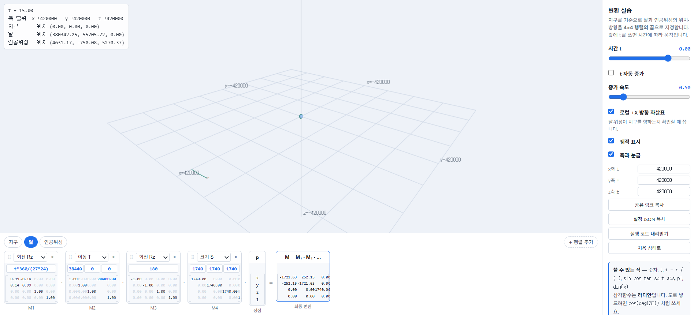
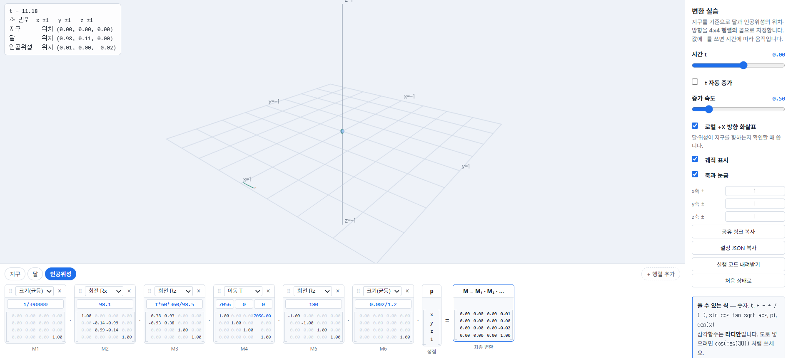
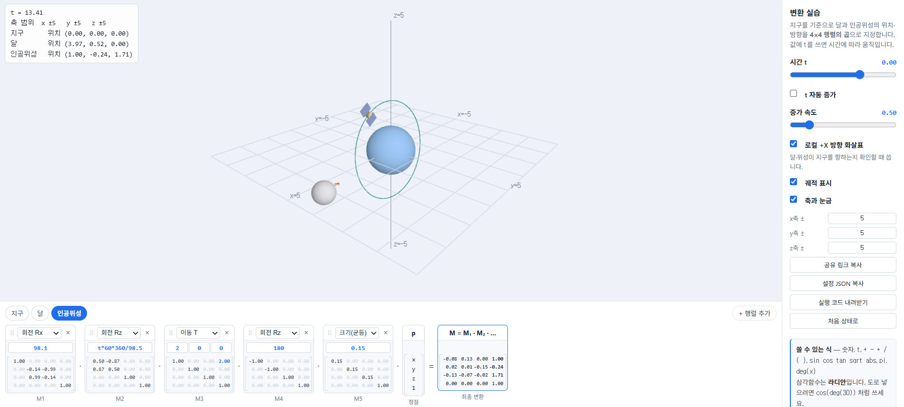

# 2주차 — 지구 · 달 · 인공위성의 변환 설계

- 이름: 장예령
- 저장소: https://github.com/yeryoung-jang/cg-2026-solar
- 실행: [Task 1](https://yeryoung-jang.github.io/cg-2026-solar/week2/task1.html) · [Task 2](https://yeryoung-jang.github.io/cg-2026-solar/week2/task2.html) · [Task 3](https://yeryoung-jang.github.io/cg-2026-solar/week2/task3.html)

<br>

## 변환 순서에 따른 움직임 비교

### 1. T를 Rz 앞으로 옮기면

`Rz - T - S`에서는 달을 지구에서 떨어뜨린 다음 회전시키므로 지구 주위를 공전합니다. 반면 `T - Rz - S`로 바꾸면 원점에서 먼저 회전한 다음 이동합니다. 따라서 달은 지구 주위를 돌지 않고 이동값으로 정한 위치에서 자전하게 됩니다. 하지만 구 모양만 보면 자전 여부를 구분하기 어려울 수 있습니다.

### 2. S를 맨 앞으로 옮기면

`Rz - T - S`를 `S - Rz - T`로 바꾸면 달의 크기뿐 아니라 지구에서 떨어진 거리에도 크기 배율이 적용됩니다. 따라서 달의 크기는 변경 전과 같지만 지구 중심에서 달 중심까지의 거리가 달라집니다. 배율이 1일 때는 크기 변환이 아무 변화도 주지 않으므로 순서를 바꿔도 차이가 없습니다.

### 3. 여섯 가지 순서 비교

표의 순서는 행렬 배치를 왼쪽부터 적은 것입니다. 실제 변환은 오른쪽부터 적용됩니다.

여기서 r은 지구 중심에서 달 중심까지의 이동 거리이고 s는 세 축에 동일하게 적용한 양수 크기 배율입닏다.

| 행렬 배치 | 달의 움직임 |
| --- | --- |
| Rz - T - S | 반지름 r로 공전한다. |
| Rz - S - T | 반지름 s*r로 공전한다. |
| S - Rz - T | 반지름 s*r로 공전한다. |
| T - Rz - S | 중심 위치가 고정되고 자전한다. |
| T - S - Rz | 중심 위치가 고정되고 자전한다. |
| S - T - Rz | 이동 거리에도 크기 배율이 적용되며 그 위치에서 자전한다. |

지구 주위를 공전하는 순서는 세가지입니다. 다만 크기 배율이 1이 아닐 때도 입력한 거리를 그대로 유지하며 공전을 올바르게 표현하는 순서는 `Rz - T - S`입니다. 이외에 `Rz - S - T`와 `S - Rz - T`는 크기 배율이 공전 거리에도 영향을 줍니다.

### 4. 예측과 실행 결과 비교

실험에는 `Rz(t*90)`, `T(2, 0, 0)`, `S(0.5, 0.5, 0.5)`를 사용했습니다. 축 범위는 세 축 모두 **5**로 설정하고 t 자동 증가로 달의 위치를 비교했습니다.

| 비교한 조건 | 예측 | 실행 결과 |
| --- | --- | --- |
| Rz - T - S | 지구 중심에서 거리 2를 유지하며 공전할 것이다. | 달의 위치값이 계속 바뀌며 지구 주위를 도는 것을 확인 |
| T - Rz - S | 위치가 (2,0,0)에 고정될 것이다. | t가 증가해도 달의 중심 위치가 (2,0,0)으로 유지 |
| S - Rz - T | 지구 중심에서 거리 1을 유지하며 공전할 것이다. | 첫 번째 조건보다 지구에 가까운 궤도로 도는 것을 확인 |

<br>

## Task 1 - 실제 비율로 배치하기

### 1. 조사한 값

| 항목 | 값 | 출처 |
| --- | ---| ---|
| 지구 반지름 | 6371km | https://nssdc.gsfc.nasa.gov/planetary/factsheet/earthfact.html |
| 달 반지름 | 약 1740km | https://science.nasa.gov/moon/facts/ |
| 지구 중심에서 달 중심까지 평균 거리 | 384400 km | https://science.nasa.gov/moon/facts/ |
| 달 공전 주기 | 약 27일 | https://science.nasa.gov/moon/facts/ |
| 대상 위성 | 아리랑 3호 | https://www.kari.re.kr/eng/contents/160 |
| 위성 고도 | 685km | https://www.kari.re.kr/eng/contents/160 |
| 위성 크기 | 지름 2m, 높이 3m | https://www.kari.re.kr/eng/contents/160 |
| 위성 공전 주기 | 98.5분 | https://www.eoportal.org/satellite-missions/kompsat-3#performance-specifications |
| 위성 궤도 경사각 | 98.1도 | https://www.eoportal.org/satellite-missions/kompsat-3#performance-specifications |

### 2. 단위를 정한 방법

- **거리 단위**

    거리 단위는 `1`이 `1km`를 나타내도록 정했습니다. 조사한 지구와 달의 반지름, 위성의 고도를 실제 km 단위 그대로 입력하고 비교하기 위해서입니다.

    | 계산한 항목 | 계산 과정 | 적용한 값 |
    | --- | --- | --- |
    | 지구 중심에서 위성까지의 거리 | 지구반지름 6371 + 고도 685 | 7056km |
    | 지구 중심에서 달의 바깥쪽까지의 거리 | 달까지 거리 384400 + 달 반지름 1740 | 386140km |
    | 축 범위 | 달 전체가 들어오도록 여유를 둠 | x, y, z 모두 420000 |

    하지만 실제 비율을 유지하면 전체 화면에서 지구와 달이 작게 보이고 인공위성의 형태는 거의 보이지 않는다는 한계가 있었습니다. 

 - **시간 단위**

     t가 **1** 증가할 때 1시간이 흐르는 것으로 설정했습니다.
    
    달의 공전 주기는 약 27일이기 때문에 회전각을 `t*360/(27*24)`로 설정했습니다.
     
     아리랑 3호는 공전 주기 98.5분을 사용하므로 시간을 분으로 바꾼 `t*60*360/98.5`를 회전각으로 설정했습니다. 

- **위성 크기를 맞춘 기준**

    실습 모형의 몸체 지름을 실제 지름인 <strong>2m(0.002km)</strong>에 맞추기 위해 `0.002/1.2`의 균등 크기 변환을 적용했습니다. 따라서 높이와 태양전지판까지 그대로 재현한 것은 아닙니다.

- **단순화한 조건**

     지구와 달은 완전한 구로 표현하고 달과 위성은 일정한 속도로 움직이는 원 궤도로 단순화했습니다.

     지구는 원점에 고정하고 자전은 표현하지 않았습니다.
 
     달은 xy평면에서 공전하도록 설정했으며 위성은 궤도 경사각을 반영해 궤도 평면을 x축 중심으로 **98.1도** 기울였습니다.

### 3. 내가 넣은 변환

**공통 축 범위**

```json
{
  "range": {
    "x": "420000",
    "y": "420000",
    "z": "420000"
  }
}
```

**지구**

```json
{
  "id": "earth",
  "name": "지구",
  "color": [0.35, 0.6, 0.95],
  "steps": [
    {
      "type": "T",
      "args": ["0", "0", "0"]
    },
    {
      "type": "S",
      "args": ["6371", "6371", "6371"]
    }
  ]
}
```

지구는 전체 배치의 기준이므로 위치를 원점에 두었습니다. 지구의 반지름은 6371km이므로 크기값을 세 축 모두 6371로 맞췄습니다.

**달**

```json
{
  "id": "moon",
  "name": "달",
  "color": [0.78, 0.78, 0.82],
  "steps": [
    {
      "type": "Rz",
      "args": ["t*360/(27*24)"]
    },
    {
      "type": "T",
      "args": ["384400", "0", "0"]
    },
    {
      "type": "Rz",
      "args": ["180"]
    },
    {
      "type": "S",
      "args": ["1740", "1740", "1740"]
    }
  ]
}
```

달의 공전 주기가 약 27일이고 t의 단위가 시간이므로 회전각을 `t*360/(27*24)`로 설정했습니다. 변환은 오른쪽부터 적용되므로 다음 순서로 동작합니다.

1. 크기: 반지름을 **1740km**로 맞춥니다.
2. 방향: 달의 +x 방향이 지구쪽을 향하게 하기 위해 <strong>Rz(180)</strong>으로 뒤집습니다. 
3. 이동: 지구 중심에서 **384400km** 떨어뜨립니다.
4. 공전: 시간에 따른 Rz를 적용하여 지구 주위를 돌게 합니다. 

**아리랑 3호**

```json
{
  "id": "sat",
  "name": "인공위성",
  "color": [0.95, 0.72, 0.35],
  "steps": [
    {
      "type": "Rx",
      "args": ["98.1"]
    },
    {
      "type": "Rz",
      "args": ["t*60*360/98.5"]
    },
    {
      "type": "T",
      "args": ["7056", "0", "0"]
    },
    {
      "type": "Rz",
      "args": ["180"]
    },
    {
      "type": "Su",
      "args": ["0.002/1.2"]
    }
  ]
}
```

아리랑 3호의 고도는 **685km**이지만 이동값에는 지구 중심에서의 거리를 넣어야 하므로 지구 반지름과 고도를 더한 **7056km**를 사용했습니다. 공전 주기는 **98.5분**이므로 t를 분으로 환산한 **t*60**을 이용해 회전각을 설정했습니다. 달과 마찬가지로 <strong>Rz(180)</strong>으로 위성의 +X 방향을 반대쪽으로 돌린 뒤 이동과 공전 회전을 적용했습니다. 마지막으로 가장 왼쪽에는 <strong>Rx(98.1)</strong>을 적용하여 궤도 경사각을 맞춰 기울였습니다. 이때 위성의 방향도 함께 회전하므로 +x가 지구 중심을 향하는 관계는 유지됩니다.

### 4. 실제 비율에서 생긴 문제와 확인한 점

- 실제 비율에서의 크기 차이

    달까지 포함하도록 축 범위를 420000으로 설정하자 지구와 달을 화면에서 아주 작게 볼 수 있었습니다. 특히 아리랑 3호는 지름이 0.002km에 불과해 전체 화면에서는 형태를 알아보기 어려웠습니다. 

- 움직임과 방향 확인

    t 자동 증가를 설정했을 때 상단에 표시되는 인공위성의 위치값이 계속 바뀌는 것을 보고 위치는 변하고 있다는 것을 확인했습니다. 다만 위치값이 바뀐다는 사실만으로 궤도나 방향까지 모두 올바르다고 판단할 수는 없었습니다. 

    인공위성이 지구를 향하는지 확인하는 과정에서 주황색 화살표가 여러 각도에서도 잘 보이지 않았습니다. 행렬 배치로는 <strong>Rz(180)</strong>이 물체의 x방향을 뒤집고 이후에 이동과 공전이 적용되어 지구쪽을 향하도록 구성했지만 화면에서 직접 화살표의 방향을 확인하기는 어려웠습니다. 태양전지판 등 모형의 일부에 가려졌을 가능성이 있다고 생각합니다.

    달은 t의 자동 증가를 켰을 때 달의 로컬 +X 방향 화살표가 계속 지구 중심쪽을 향하는 것을 확인했습니다.

- 실행 화면 문제와 수정

    마지막 점검 과정에서 실행 코드를 내려받아 열어봤을 때는 화면을 아무리 확대축소를 해봐도 파란색으로만 보이는 문제도 있었습니다. AI의 도움을 받아 확인해본 결과, 카메라 거리와 확대축소 범위가 km 단위로 커진 장면에 맞지 않았습니다. 이 값을 장면의 범위에 맞게 수정한 파일을 다시 실행하자 전체가 보였습니다. 물체의 변환값뿐 아니라 카메라 설정도 장면의 크기에 맞아야 한다는 점을 알게 되었습니다.

<br>



- 공유 링크: [Task 1 설정 열기](https://cg.catholic.ac.kr/~mgchoi/CG/demos/d02-transform-lab.html?d=eyJyYW5nZSI6eyJ4IjoiNDIwMDAwIiwieSI6IjQyMDAwMCIsInoiOiI0MjAwMDAifSwib2JqZWN0cyI6W3siaWQiOiJlYXJ0aCIsIm5hbWUiOiLsp4DqtawiLCJjb2xvciI6WzAuMzUsMC42LDAuOTVdLCJzdGVwcyI6W3sidHlwZSI6IlQiLCJhcmdzIjpbIjAiLCIwIiwiMCJdfSx7InR5cGUiOiJTIiwiYXJncyI6WyI2MzcxIiwiNjM3MSIsIjYzNzEiXX1dfSx7ImlkIjoibW9vbiIsIm5hbWUiOiLri6wiLCJjb2xvciI6WzAuNzgsMC43OCwwLjgyXSwic3RlcHMiOlt7InR5cGUiOiJSeiIsImFyZ3MiOlsidCozNjAvKDI3KjI0KSJdfSx7InR5cGUiOiJUIiwiYXJncyI6WyIzODQ0MDAiLCIwIiwiMCJdfSx7InR5cGUiOiJSeiIsImFyZ3MiOlsiMTgwIl19LHsidHlwZSI6IlMiLCJhcmdzIjpbIjE3NDAiLCIxNzQwIiwiMTc0MCJdfV19LHsiaWQiOiJzYXQiLCJuYW1lIjoi7J246rO17JyE7ISxIiwiY29sb3IiOlswLjk1LDAuNzIsMC4zNV0sInN0ZXBzIjpbeyJ0eXBlIjoiUngiLCJhcmdzIjpbIjk4LjEiXX0seyJ0eXBlIjoiUnoiLCJhcmdzIjpbInQqNjAqMzYwLzk4LjUiXX0seyJ0eXBlIjoiVCIsImFyZ3MiOlsiNzA1NiIsIjAiLCIwIl19LHsidHlwZSI6IlJ6IiwiYXJncyI6WyIxODAiXX0seyJ0eXBlIjoiU3UiLCJhcmdzIjpbIjAuMDAyLzEuMiJdfV19XX0%3D)

<br>

## Task 2 - NDC 범위에 맞추기

### 1. 배율을 정한 방법

공통 배율 **s**는 `1/390000`으로 정했습니다. 지구에서 가장 먼 물체는 달이므로 달의 중심까지의 거리뿐 아니라 달의 반지름도 포함해서 계산했습니다. 달의 바깥쪽까지의 거리는 `384400 + 1740 = 386140`입니다. 이보다 조금 큰 **390000**으로 나누면 가장 먼 지점도 0.9901이 되어 -1~1 범위 안에 들어옵니다. 따라서 세 물체에 같은 배율을 적용하고, 축 범위는 모두 1로 설정했습니다.

### 2. 배율 행렬을 맨 앞에 넣은 이유

변환은 오른쪽부터 적용되므로 새 배율 행렬을 가장 왼쪽에 넣으면 마지막에 적용됩니다. 이렇게 하면 Task 1에서 정한 물체의 크기와 지구에서 떨어진 거리가 함께 줄어듭니다. 반대로 가장 오른쪽에 넣으면 물체 자체의 크기만 먼저 줄어들고 이후 적용되는 이동값은 그대로 남습니다. 달의 경우 크기는 줄어도 지구에서 떨어진 거리는 여전히 384400이므로 장면 전체를 -1~1범위 안에 넣을 수 없습니다.

### 3. 세 물체에 같은 배율을 쓴 이유

Task 1에서 만든 실제 비율을 유지하기 위해 같은 배율을 사용했습니다. 지구, 달, 인공위성의 크기와 거리를 모두 같은 비율로 줄이면 서로의 크기 비율과 거리 관계가 유지되기 때문입니다. 물체마다 다른 배율을 적용하면 어떤 물체는 더 많이 줄어들고 다른 물체는 덜 줄어들어 처음에 조사한 실제 비율이 달라집니다.

### 4. 비율을 유지했을 때 보이는 모습

전체 배치를 범위 안에 넣으니 지구는 화면 가운데 작은 점처럼 보였고 인공위성은 거의 보이지 않았습니다. 지구 반지름은 배율을 적용한 뒤 약 **0.0163**이 되지만 인공위성의 몸체 지름은 약 **0.00000000513**이 되어 지구보다 훨씬 작기 때문입니다. t 자동증가를 설정했을 때 달과 인공위성의 상단 위치값이 바뀌는 것은 확인했습니다. 하지만 화면에서 직접 천체들의 크기와 움직임을 자세히 살펴보기는 어려웠습니다.

### 5. 내가 넣은 변환

```json
{
  "range": {
    "x": "1",
    "y": "1",
    "z": "1"
  },
  "objects": [
    {
      "id": "earth",
      "name": "지구",
      "color": [
        0.35,
        0.6,
        0.95
      ],
      "steps": [
        {
          "type": "Su",
          "args": [
            "1/390000"
          ]
        },
        {
          "type": "T",
          "args": [
            "0",
            "0",
            "0"
          ]
        },
        {
          "type": "S",
          "args": [
            "6371",
            "6371",
            "6371"
          ]
        }
      ]
    },
    {
      "id": "moon",
      "name": "달",
      "color": [
        0.78,
        0.78,
        0.82
      ],
      "steps": [
        {
          "type": "Su",
          "args": [
            "1/390000"
          ]
        },
        {
          "type": "Rz",
          "args": [
            "t*360/(27*24)"
          ]
        },
        {
          "type": "T",
          "args": [
            "384400",
            "0",
            "0"
          ]
        },
        {
          "type": "Rz",
          "args": [
            "180"
          ]
        },
        {
          "type": "S",
          "args": [
            "1740",
            "1740",
            "1740"
          ]
        }
      ]
    },
    {
      "id": "sat",
      "name": "인공위성",
      "color": [
        0.95,
        0.72,
        0.35
      ],
      "steps": [
        {
          "type": "Su",
          "args": [
            "1/390000"
          ]
        },
        {
          "type": "Rx",
          "args": [
            "98.1"
          ]
        },
        {
          "type": "Rz",
          "args": [
            "t*60*360/98.5"
          ]
        },
        {
          "type": "T",
          "args": [
            "7056",
            "0",
            "0"
          ]
        },
        {
          "type": "Rz",
          "args": [
            "180"
          ]
        },
        {
          "type": "Su",
          "args": [
            "0.002/1.2"
          ]
        }
      ]
    }
  ]
}
```

- 공통 배율: Task 1의 실제 비율을 유지하면서 전체 배치를 -1~1 범위 안에 넣기 위해 지구, 달, 인공위성에 공통으로 **1/390000**의 균등 크기 변환을 추가했습니다. 가장 먼 달의 바깥쪽까지의 거리가 386140km이므로 이보다 조금 큰 390000으로 나누면 약 0.9901이 되어 범위 안에 들어옵니다. 

- 축 범위: 세 축 모두 1로 설정했습니다. 

- 배치 순서: 새로운 크기 변환은 세 물체 모두 카드 배치의 가장 왼쪽에 넣었습니다. 오른쪽부터 적용되기 때문에 Task 1의 변환이 적용된 뒤 물체의 크기와 지구에서 떨어진 거리가 함께 줄어들도록 설정한 것입니다. 같은 배율을 사용해 세 물체 사이의 실제 크기와 거리 비율도 유지했습니다.

- 유지한 값: Task 1의 크기와 이동값, 공전 회전식, 지구를 향하도록 넣은 `Rz(180)`, 위성 궤도를 기울이는 `Rx(98.1)`은 유지했습니다. 

<br>



- 공유 링크: [Task 2 설정 열기](https://cg.catholic.ac.kr/~mgchoi/CG/demos/d02-transform-lab.html?d=eyJyYW5nZSI6eyJ4IjoiMSIsInkiOiIxIiwieiI6IjEifSwib2JqZWN0cyI6W3siaWQiOiJlYXJ0aCIsIm5hbWUiOiLsp4DqtawiLCJjb2xvciI6WzAuMzUsMC42LDAuOTVdLCJzdGVwcyI6W3sidHlwZSI6IlN1IiwiYXJncyI6WyIxLzM5MDAwMCJdfSx7InR5cGUiOiJUIiwiYXJncyI6WyIwIiwiMCIsIjAiXX0seyJ0eXBlIjoiUyIsImFyZ3MiOlsiNjM3MSIsIjYzNzEiLCI2MzcxIl19XX0seyJpZCI6Im1vb24iLCJuYW1lIjoi64usIiwiY29sb3IiOlswLjc4LDAuNzgsMC44Ml0sInN0ZXBzIjpbeyJ0eXBlIjoiU3UiLCJhcmdzIjpbIjEvMzkwMDAwIl19LHsidHlwZSI6IlJ6IiwiYXJncyI6WyJ0KjM2MC8oMjcqMjQpIl19LHsidHlwZSI6IlQiLCJhcmdzIjpbIjM4NDQwMCIsIjAiLCIwIl19LHsidHlwZSI6IlJ6IiwiYXJncyI6WyIxODAiXX0seyJ0eXBlIjoiUyIsImFyZ3MiOlsiMTc0MCIsIjE3NDAiLCIxNzQwIl19XX0seyJpZCI6InNhdCIsIm5hbWUiOiLsnbjqs7XsnITshLEiLCJjb2xvciI6WzAuOTUsMC43MiwwLjM1XSwic3RlcHMiOlt7InR5cGUiOiJTdSIsImFyZ3MiOlsiMS8zOTAwMDAiXX0seyJ0eXBlIjoiUngiLCJhcmdzIjpbIjk4LjEiXX0seyJ0eXBlIjoiUnoiLCJhcmdzIjpbInQqNjAqMzYwLzk4LjUiXX0seyJ0eXBlIjoiVCIsImFyZ3MiOlsiNzA1NiIsIjAiLCIwIl19LHsidHlwZSI6IlJ6IiwiYXJncyI6WyIxODAiXX0seyJ0eXBlIjoiU3UiLCJhcmdzIjpbIjAuMDAyLzEuMiJdfV19XX0%3D)

<br>

## Task 3 - 보는 사람을 위한 표현

### 1. 실제 비율이 정보를 전달하기에 적합한가?

Task 1과 Task 2에서는 실제 비율을 유지했지만 달까지 한 화면에 담으니 지구가 작게 보이고 인공위성의 형태는 거의 보이지 않았습니다. 상단의 위치값으로 움직임은 확인할 수 있었지만 화면으로 직접 인공위성이 어떻게 움직이는지 살펴보기는 어려웠습니다. 실제 크기와 거리의 차이를 정확히 보여주는 데에는 실제 비율이 의미가 있지만 각 물체의 모습과 공전하는 모습을 확인하기에는 불편하다고 생각했습니다. 따라서 공전하는 모습을 쉽게 보여주려면 크기와 거리를 조절할 필요가 있다고 판단했습니다.

### 2. 내가 선택한 표현 방법

Task 3에서는 세 물체의 모양과 공전하는 모습을 한 화면에서 알아보기 쉽게 만드는 것을 목표로 했습니다.

- 선택한 방법
    - 지구 반지름을 1로 두고 달과 위성은 실제 비율보다 상대적으로 크게 표현했습니다.
    - 달은 한 화면에 들어오도록 가까이 배치했습니다.
    - 위성은 지구와 구분하기 쉽도록 더 떨어뜨렸습니다.


Task 2의 공통 배율을 제거하고 크기와 이동값을 다음과 같이 바꿨습니다.

| 항목 | Task 3 설정 | 이유 |
| --- | --- | --- |
| 지구 반지름 | 1 | 다른 물체의 크기와 거리를 비교하는 기준으로 사용 |
| 달 반지름 | 0.4 | 달의 모양을 확인하기 쉽도록 상대적으로 크게 설정 |
| 지구 중심에서 달 중심까지의 거리 | 4 | 지구와 달이 떨어져 보이면서 한 화면에 들어오도록 설정 |
| 위성의 균등 크기 배율 | 0.15 | 너무 작아서 보이지 않던 위성을 알아볼 수 있도록 크게 설정 |
| 지구 중심에서 위성 중심까지의 거리 | 2 | 지구와 겹치지 않고 주위를 도는 모습을 보기 쉽도록 설정 |
| 축 범위 | x, y, z 모두 5 | 달의 바깥쪽까지 거리인 4.4보다 여유롭게 설정 |

이 값들은 화면에서 잘 보이도록 정한 표시용 값이지만 공전 주기를 정하는 수식과 위성의 궤도 경사각 `98.1도`는 기존 설정을 유지했습니다. 크기와 거리는 수정했지만 시간에 따른 회전과 궤도가 기울어진 모습은 유지하고자 했습니다.

### 3. 내가 넣은 변환

```json
{
  "range": {
    "x": "5",
    "y": "5",
    "z": "5"
  },
  "objects": [
    {
      "id": "earth",
      "name": "지구",
      "color": [
        0.35,
        0.6,
        0.95
      ],
      "steps": [
        {
          "type": "T",
          "args": [
            "0",
            "0",
            "0"
          ]
        },
        {
          "type": "S",
          "args": [
            "1",
            "1",
            "1"
          ]
        }
      ]
    },
    {
      "id": "moon",
      "name": "달",
      "color": [
        0.78,
        0.78,
        0.82
      ],
      "steps": [
        {
          "type": "Rz",
          "args": [
            "t*360/(27*24)"
          ]
        },
        {
          "type": "T",
          "args": [
            "4",
            "0",
            "0"
          ]
        },
        {
          "type": "Rz",
          "args": [
            "180"
          ]
        },
        {
          "type": "S",
          "args": [
            "0.4",
            "0.4",
            "0.4"
          ]
        }
      ]
    },
    {
      "id": "sat",
      "name": "인공위성",
      "color": [
        0.95,
        0.72,
        0.35
      ],
      "steps": [
        {
          "type": "Rx",
          "args": [
            "98.1"
          ]
        },
        {
          "type": "Rz",
          "args": [
            "t*60*360/98.5"
          ]
        },
        {
          "type": "T",
          "args": [
            "2",
            "0",
            "0"
          ]
        },
        {
          "type": "Rz",
          "args": [
            "180"
          ]
        },
        {
          "type": "Su",
          "args": [
            "0.15"
          ]
        }
      ]
    }
  ]
}
```

- 크기와 거리 설정

    - Task 2에서 사용한 공통 배율 **1/390000**을 세 물체에서 모두 제거했습니다. 
    - 지구는 기준이 되도록 위치를 원점에 두고 반지름을 **1**로 설정했습니다. 
    - 달은 지구와 함께 한 화면에서 볼 수 있도록 이동값을 <strong>(4, 0, 0)</strong>으로 정하고 모양을 알아보기 쉽도록 반지름을 **0.4**로 설정했습니다.
    - 위성은 지구에서 떨어져 도는 모습을 보기 쉽도록 이동값을 <strong>(2, 0, 0)</strong>으로 설정하고 크기 배율은 **0.15**로 수정해서 실제 비율에서 잘 보이지 않던 위성의 전체 모양을 알아볼 수 있도록 했습니다. 균등 크기 변환을 사용했기 때문에 제공된 위성 모형의 가로세로 비율은 유지됩니다. 
    
- 유지한 변환

    - 달과 위성의 회전식을 유지해 기존 공전 주기를 따르도록 했습니다. 
    - 로컬 +X 방향이 지구를 향하도록 넣은 `Rz(180)`과 위성 궤도의 기울기를 정하는 `Rx(98.1)`도 유지했습니다. 
    
- 축 범위

    - 달의 바깥쪽까지 거리는 **4 + 0.4 = 4.4**이므로 여유를 두어 세 축 모두 **5**로 설정했습니다. 이 배치는 세 물체를 구분하기 쉽게 하기 위한 것으로 실제 크기와 거리 비율은 유지되지 않습니다.

### 4. 실제 비율과 달라진 점

크기와 거리를 각각 조절했기 때문에 실제 비율은 유지되지 않습니다. 예를 들어, 실제 달까지의 거리는 지구 반지름의 **약 60.3배**이지만 이 화면에서는 **4배**로 줄였습니다. 따라서 이 화면으로 실제 거리나 물체의 크기를 판단하면 잘못 이해할 수 있습니다. 실제 수치를 비교할 때는 Task 1, 2의 설정을 참고하고 Task 3의 화면은 물체의 모습과 공전하는 모습을 설명하는 용도로 사용하는 것이 적합합니다.

<br>



Task 2에서는 인공위성의 형태를 알아보기 어려웠지만 수정한 화면에서는 지구, 달, 인공위성의 모습을 한 화면에서 함께 확인할 수 있었습니다.

- 공유 링크: [Task 3 설정 열기](https://cg.catholic.ac.kr/~mgchoi/CG/demos/d02-transform-lab.html?d=eyJyYW5nZSI6eyJ4IjoiNSIsInkiOiI1IiwieiI6IjUifSwib2JqZWN0cyI6W3siaWQiOiJlYXJ0aCIsIm5hbWUiOiLsp4DqtawiLCJjb2xvciI6WzAuMzUsMC42LDAuOTVdLCJzdGVwcyI6W3sidHlwZSI6IlQiLCJhcmdzIjpbIjAiLCIwIiwiMCJdfSx7InR5cGUiOiJTIiwiYXJncyI6WyIxIiwiMSIsIjEiXX1dfSx7ImlkIjoibW9vbiIsIm5hbWUiOiLri6wiLCJjb2xvciI6WzAuNzgsMC43OCwwLjgyXSwic3RlcHMiOlt7InR5cGUiOiJSeiIsImFyZ3MiOlsidCozNjAvKDI3KjI0KSJdfSx7InR5cGUiOiJUIiwiYXJncyI6WyI0IiwiMCIsIjAiXX0seyJ0eXBlIjoiUnoiLCJhcmdzIjpbIjE4MCJdfSx7InR5cGUiOiJTIiwiYXJncyI6WyIwLjQiLCIwLjQiLCIwLjQiXX1dfSx7ImlkIjoic2F0IiwibmFtZSI6IuyduOqzteychOyEsSIsImNvbG9yIjpbMC45NSwwLjcyLDAuMzVdLCJzdGVwcyI6W3sidHlwZSI6IlJ4IiwiYXJncyI6WyI5OC4xIl19LHsidHlwZSI6IlJ6IiwiYXJncyI6WyJ0KjYwKjM2MC85OC41Il19LHsidHlwZSI6IlQiLCJhcmdzIjpbIjIiLCIwIiwiMCJdfSx7InR5cGUiOiJSeiIsImFyZ3MiOlsiMTgwIl19LHsidHlwZSI6IlN1IiwiYXJncyI6WyIwLjE1Il19XX1dfQ%3D%3D)

- 공유 링크 표시 문제

    공유 링크를 열면 오른쪽 축 입력칸에는 기본값인 3이 표시되었지만 상단의 축 범위와 화면에는 제가 설정한 값인 5가 올바르게 표시되었습니다. 입력칸에 3이 표시되는 오류를 계속해서 개선해보려고 했지만 해결하지 못했습니다.