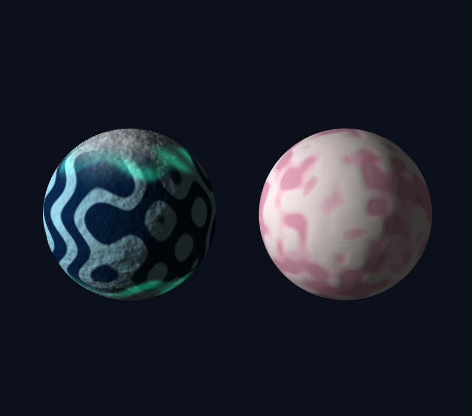

# 3주차 — 그래픽스 파이프라인과 셰이더

- 이름: 장예령
- 저장소: https://github.com/yeryoung-jang/cg-2026-solar
- 실행: [Task 1](https://yeryoung-jang.github.io/cg-2026-solar/week3/task1.html) · [Task 2](https://yeryoung-jang.github.io/cg-2026-solar/week3/task2.html)

<br>

## Task 1 - 삼각형에서 3차원 장면까지 따라 하며 코드 구조 익히기

<br>

### 1. 구현한 장면

제공된 삼각형 예제를 수정해 바닥 위에 공이 떠서 자전하는 장면을 만들었습니다. 이번 실습에서는 y축을 위쪽으로 사용했고 장면을 대각선 위에서 내려다보도록 설정했습니다.

| 항목 | 설정 | 이유 |
| --- | --- | --- |
| 공의 반지름 | `0.8` | 제공된 예제의 크기 사용 |
| 공 중심 | `(0, 1.9, 0)` | 바닥에서 떨어져 있도록 배치 |
| 바닥 크기 | `8*0.12*8` | 납작한 상자로 바닥 만들기 |
| 바닥 중심 | `(0, -0.06, 0)` | 바닥 윗면이 `y = 0`에 오도록 설정 |
| 공의 회전 | `t*0.8` | 시간이 지날수록 y축 주위를 회전하도록 설정 |

공의 가장 아래쪽 높이는 `1.9 - 0.8 = 1.1`이므로 바닥과 닿지 않습니다. 또한 공 표면의 밝기를 경도에 따라 다르게 주어 구가 회전하는 모습을 구분할 수 있게 했습니다.

<br>

### 2. 이동과 회전의 순서 비교

**실행 조건**

기본 이동값인 `(0, 1.9, 0)`은 y축의 위치입니다. 따라서 y축 회전과 이동의 순서만 바꾸어서는 공 중심의 위치가 달라지지 않습니다.

두 순서의 차이를 확인하기 위해 비교 실험에서는 이동값을 `(2, 1.9, 0)`으로 바꾸어  공용 y축에서 옆으로 떨어뜨렸습니다. 공의 크기와 회전 속도는 두 실험에서 동일하게 유지했습니다.

**이동 x 회전 - T x R**

```js
const model = M4.multiply(
    M4.translate(2, 1.9, 0),
    M4.rotateY(time * 0.8)
);
```

- 예측: 회전이 먼저 적용되고 그 다음 이동하므로, 공 중심은 고정되고 공이 제자리에서 돌 것이다.
- 관찰: 공 중심은 같은 자리에 있고 표면의 무늬가 회전하는 모습을 확인


**회전 x 이동 - R x T**

```js
const model = M4.multiply(
  M4.rotateY(time * 0.8),
  M4.translate(2, 1.9, 0)
);
```

- 예측: 먼저 옳긴 위치까지 이동하므로 공 중심이 y축 주위를 움직일 것이다.
- 관찰: 공이 한자리에 머무르지 않고 바닥 위에서 원을 따라 움직이는 모습을 확인


**결과 해석**

행렬은 오른쪽부터 적용되므로 `T*R`에서는 원점에서 공을 자기 중심을 기준으로 회전시킨 다음 (2, 1.9, 0)으로 옮깁니다. 시간이 지나도 이동값은 그대로이고 회전각만 바뀌므로 공의 위치는 고정된 채 제자리에서 회전합니다. 반대로 `R * T`에서는 먼저 옮긴 공을 원점의 y축 주위로 돌리기 때문에 중심 위치도 움직입니다. 계산상 두 번째 경우 공 중심은 높이 `1.9`를 유지하며 y축에서 거리 2인 원을 따라 움직입니다.

비교가 끝난 뒤에는 이동값을 `(0, 1.9, 0)`으로 되돌리고 `T * R` 순서를 사용해 바닥 가운데 위에서 자전하도록 복구했습니다.

<br>

### 3. 프래그먼트 셰이더 변경 - 계단식 음영

**변경 목적**

같은 공이라도 픽셀의 밝기를 계산하는 방법에 따라 어떻게 다르게 보이는지 확인하기 위해 기존의 부드러운 명암을 일정한 밝기 간격으로 나누는 계단식 음영으로 변경했습니다.

**사용한 셰이더 코드**

```glsl
#version 300 es
precision highp float;

in vec3 vColor;
in vec3 vNormal;

uniform float uTime;

out vec4 fragColor;

void main() {
  vec3 N = normalize(vNormal);
  vec3 L = normalize(vec3(-1.0, 0.3, 0.5));

  float diff = max(dot(N, L), 0.0);
  float level = floor(diff * 4.0) / 4.0;

  vec3 color = vColor * (0.2 + 0.8 * level);
  fragColor = vec4(color, 1.0);
}
```

**계산 방법**

- `normalize(vNormal)`은 보간된 법선의 길이를 1로 맞춥니다.
- `dot(N, L)`은 표면 방향과 광원 방향을 비교합니다. 빛을 정면으로 받을수록 값이 커집니다.
- `max(..., 0.0)`은 빛을 등진 면에서 나오는 음수를 0으로 제한합니다.
- `floor(diff * 4.0) / 4.0`은 밝기를 `0.25` 간격으로 나눕니다.
- `0.2 + 0.8 * level`을 사용해 어두운 부분에도 최소 밝기를 남겼습니다.


**관찰한 결과**

기존에는 공의 밝은 부분에서 어두운 부분으로 밝기가 부드럽게 이어졌습니다. 툰 셰이딩을 적용한 뒤에는 밝기가 몇 단계로 나뉘면서 공 표면에 띠처럼 경계가 보였습니다. 공의 둥근 모양은 그대로지만 색의 경계가 뚜렷해져 단순한 느낌이 들었습니다.

<br>

### 4. 깊이 테스트와 수정 과정

**깊이 테스트 비교**

`gl.enable(gl.DEPTH_TEST)`를 `gl.disable(gl.DEPTH_TEST)로 바꾸어 비교했습니다. 화면에서는 깊이 테스트를 껐을 때 바닥 색이 달라져 보였습니다.

깊이 테스트는 겹치는 부분의 깊이를 비교해 앞쪽 표면이 보이게 하는 기능입니다. 이를 끄면 그리는 순서에 따라 다른 면이 덮일 수 있습니다. 실험 후에는 깊이 테스트를 다시 켰습니다.

**조명 출력 확인**

조명 효과가 잘 구분되지 않아 프래그먼트 셰이더를 확인했습니다. 밝기를 계산한 `color`를 최종 출력인 `fragColor`에 넣는 줄이 빠져 있어 다음 코드를 추가했습니다. 

```glsl
fragColor = vec4(color, 1.0);
```
또한 명암 차이를 확인하기 쉽도록 광원 방향을 `(-1.0, 0.3, 0.5)`로 설정했습니다.

<br>

### 5. 코드 구조 정리

| 구역 | 역할 |
| --- | --- |
| 메시 데이터 | 공과 바닥의 정점 위치, 법선, 색, 인덱스 만들기 |
| 버텍스 셰이더 | 정점에 물체 변환과 카메라·투영 변환을 적용 |
| 프래그먼트 셰이더 | 보간된 값을 받아 픽셀의 색과 밝기를 계산 |
| WebGL 준비 | 셰이더를 컴파일하고 프로그램으로 연결 |
| 버퍼 만들기 | 메시 데이터를 GPU로 보내고 읽는 방법을 설정 |
| 그리기 루프 | 시간에 따라 행렬을 갱신하고 바닥과 공을 반복해서 그리기 |

출발 예제에서 삼각형 안의 색이 부드럽게 이어지는 것은 래스터화 과정에서 GPU가 꼭짓점 사이의 색을 보간하기 때문입니다.

<br>

## Task 2 - 살아 있는 행성 만들기

<br>

### 1. 구현한 장면

Task 1에서 사용한 구 형태의 3D 모델을 바탕으로 서로 다른 표면을 가진 두 행성을 만들었습니다. 두 행성은 구 메시와 버텍스 셰이더를 사용하지만 각각 다른 프래그먼트 셰이더를 적용하도록 구성했습니다.

왼쪽에는 얼음 행성, 오른쪽에는 벚꽃을 표현한 행성을 배치했습니다. 두 행성 모두 약간 기울어진 상태에서 y축을 중심으로 자전하도록 했고 자전 속도는 서로 다르게 설정했습니다.

| 항목 | 얼음 행성 | 벚꽃 행성 |
| --- | --- | --- |
| x 위치 | `-1.0` | `1.0` |
| 기울기 | `0.25` | `0.25` |
| 자전 속도 | `0.8` | `0.5` |
| 기본 형태 | 반지름 `0.8`의 구 | 반지름 `0.8`의 구 |
| 주요 표현 | 얼음 무늬, 극지방, 오로라, 표면 요철 | 분홍색 표면, 꽃잎 무늬, 표면 요철 |

두 행성이 같은 화면에 들어오도록 가운데를 바라보는 카메라를 사용했으며 화면의 가로세로 비율에 따라 크기를 조정하도록 했습니다.

<br>

### 2. 얼음 행성

얼음 행성은 짙은 파란색과 밝은 하늘색을 섞어 기본 표면을 만들었습니다. `sin()` 값을 여러 방향으로 조합해 일정하지 않은 얼음 무늬를 만들고 `smoothstep()`을 사용해 두 색이 갑자기 끊기지 않고 자연스럽게 나뉘도록 했습니다.

극지방은 `abs(S.y)` 값을 이용해 위쪽과 아래쪽으로 갈수록 밝은 얼음색과 흰색이 많이 섞이도록 했습니다. 또한 극지방 근처에는 청록색 오로라를 추가했습니다. 오로라의 위치와 밝기에 `uTime`을 사용해 시간이 지나면서 띠의 모양과 밝기가 조금씩 변하도록 했습니다.

처음에는 색의 변화만 있어서 행성 표면이 매끈하게 보였습니다. 이를 보완하기 위해 노이즈로 높낮이 값을 만들고 주변 값의 차이로 법선을 변화시켜 실제 구의 메시를 크게 변형하지 않고도 빛을 받는 방향에 차이가 생기도록 수정했습니다. 그 결과 이전보다 표면의 밝기가 불규칙하게 나타나면서 거친 얼음 표면처럼 보이게 했습니다.

<br>

### 3. 벚꽃 행성

벚꽃 행성은 `noise3()`을 이용해 분홍색과 옅은 우윳빛이 섞이는 큰 덩어리 형태의 표면을 만들었습니다. 작은 점무늬가 반복되기보다는 전체적으로 부드러운 색 변화가 나타나도록 큰 노이즈의 비중을 높였습니다.

표면에는 벚꽃잎 모양을 추가했습니다. 행성 전체에 꽃잎의 중심점을 나누어 배치하고 각 중심에서 접선 방향을 구해 꽃잎 모양을 그렸습니다. 꽃잎의 크기와 색은 조금씩 다르게 하고 가장자리로 갈수록 색을 연하게 섞어 단색으로 붙어 있는 느낌을 줄였습니다.

꽃잎의 방향은 각 꽃잎마다 서로 다른 고정 각도를 사용했습니다. 따라서 행성 자체는 계속 자전하지만 꽃잎의 방향이 시간에 따라 따로 회전하지 않고 행성 표면에 붙어 있는 무늬처럼 함께 움직입니다.

<br>

### 4. 수정 과정과 검증

**얼음 행성의 표면 수정**

처음 만든 얼음 행성은 색 무늬는 잘 보였지만 구의 표면 자체는 매끈하게 느껴졌습니다. 얼음판 사이에 균열을 직접 그리는 방법도 적용해 보았지만 규칙적인 조각이 반복되어 자연스러운 얼음 느낌 보다는 인위적인 타일처럼 보였습니다.

그래서 균열 표현은 제거하고 노이즈를 이용한 높낮이와 법선 변화를 사용하는 방법으로 행성의 표면을 울퉁불퉁하게 변경했습니다.

**꽃잎의 회전 방향 수정**

처음에는 꽃잎마다 랜덤한 방향을 만들기 위해 시작 각도에 `uTime`을 이용한 회전값과 흔들림을 추가했습니다.

```glsl
float rotation = startAngle
    + uTime * turnSpeed * turnDirection
    + sway;
```

예상한 결과는 각각의 꽃잎이 서로 다른 방향을 가진 상태로 행성과 함께 자전하는 것이었습니다. 하지만 실제로 실행해 보니 꽃잎들의 방향은 전부 일정하고 행성이 회전하는 동안 꽃잎들의 방향도 계속 동일하게 바뀌었습니다.

따라서 시간에 따라 변하는 회전값을 제거하고 각 꽃잎에 고정된 각도를 사용하도록 수정했습니다.

수정 후에는 꽃잎마다 방향이 다르면서도 한 꽃잎의 방향은 계속 유지되었고 행성이 자전할 때 표면과 함께 움직였습니다.

<br>

### 5. AI 코드에서 수정한 부분

얼음 행성의 표면 요철을 추가하는 과정에서 AI가 제안한 코드에 `uModel`을 사용하는 부분이 있었지만 프래그먼트 셰이더에는 해당 uniform 선언이 빠져있었습니다.

```glsl
vec3 N = normalize(
    mat3(uModel) * localNormal
);
```

이 상태로 실행했을 때 행성이 보이지 않고 화면에는 배경만 나타났습니다. 코드를 확인한 뒤 프래그먼트 셰이더 위쪽에 다음 선언을 추가했습니다.

```glsl
uniform mat4 uModel;
```

이후 셰이더가 정상적으로 실행되었고 두 행성이 다시 화면에 표시되었습니다. 단순히 결과가 나오지 않는다고 코드를 다시 만드는 대신 셰이더 안에서 사용한 변수와 uniform 선언을 확인하면서 원인을 찾았습니다.

<br>

### 6. 최종 결과 확인



같은 구 메시를 사용해도 프래그먼트 셰이더에서 색과 표면 무늬, 법선을 어떻게 계산하는지에 따라 서로 다른 행성으로 표현되는 것을 확인했습니다. 얼음 행성은 파란색 계열의 무늬와 극지방의 오로라, 불규칙한 표면을 사용했고 벚꽃 행성은 분홍색 노이즈와 꽃잎 무늬를 사용했습니다.

또한 `uTime`은 행성의 자전이나 오로라처럼 시간이 지나면서 변해야 하는 효과에는 사용할 수 있지만 꽃잎의 방향처럼 표면에 고정되어야 하는 값에 사용하면 의도하지 않은 움직임이 생길 수 있다는 점을 확인했습니다.

<br>
