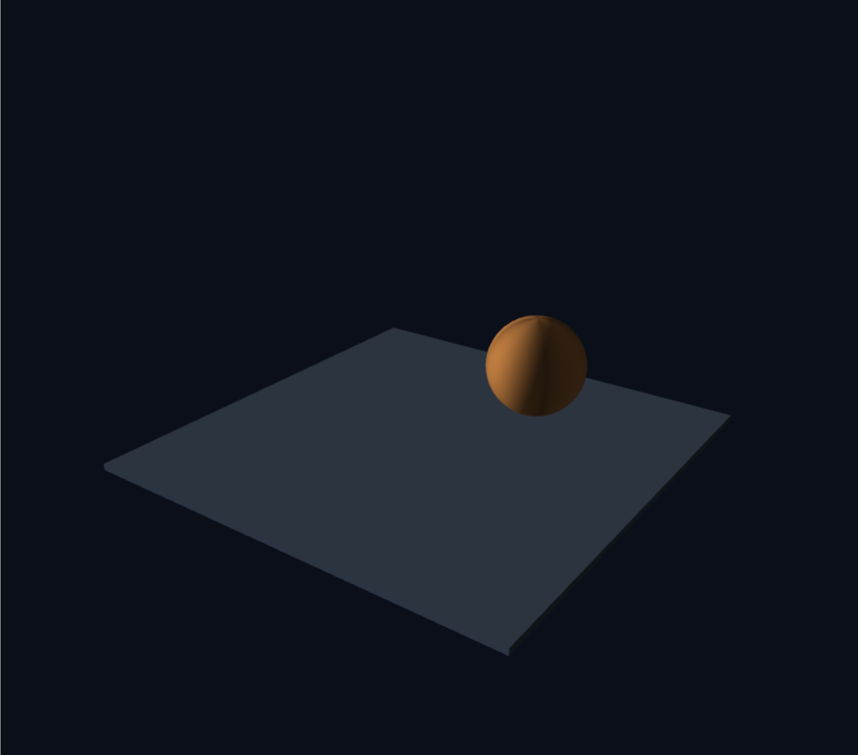
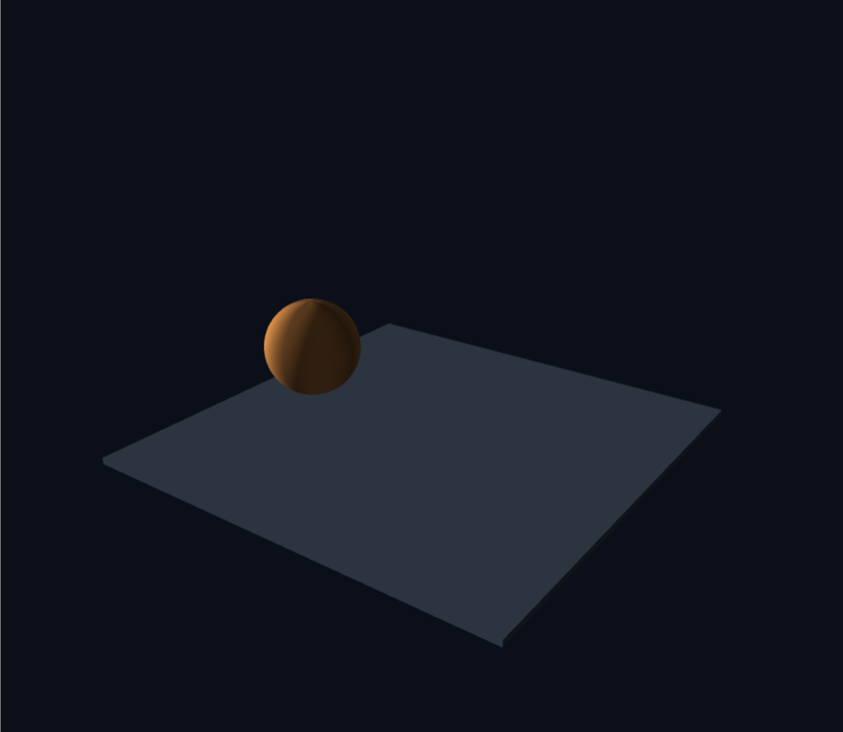
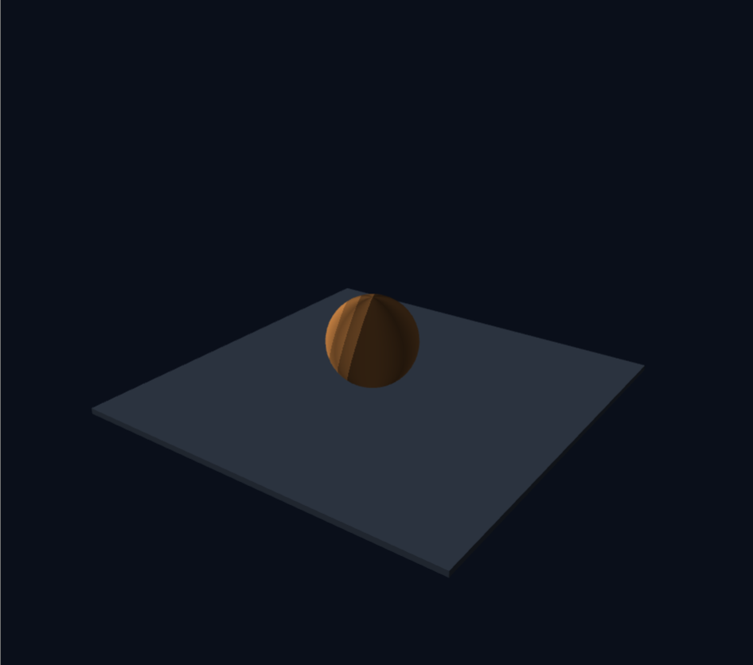

# 3주차 — 그래픽스 파이프라인과 셰이더

- 이름: 장예령
- 저장소: https://github.com/yeryoung-jang/cg-2026-solar
- 실행: [Task 1](https://yeryoung-jang.github.io/cg-2026-solar/week3/task1.html) · [Task 2](https://yeryoung-jang.github.io/cg-2026-solar/week3/task2.html)

<br>

## Task 1 - 삼각형에서 3차원 장면까지 따라 하며 코드 구조 익히기

### 1. 구현한 장면

제공된 삼각형 예제를 수정해 바닥 위에 공이 떠서 자전하는 장면을 만들었습니다. 이번 실습에서는 y축을 위쪽으로 사용했고 장면을 대각선 위에서 내려다보도록 설정했습니다.

| 항목 | 설정 | 이유 |
| --- | --- | --- |
| 공의 반지름 | `0.8` | 제공된 예제의 크기 사용 |
| 공 중심 | `(0, 1.9, 0)` | 바닥에서 떨어져 있도록 배치 |
| 바닥 크기 | `8*0.12*8` | 납작한 상자로 바닥 만들기 |
| 바닥 중심 | `(0, -0.06, 0)` | 바닥 윗면이 `y = 0`에 오도록 설정 |
| 공의 회전 | `t*0.8` | 시간이 지날수록 y축 주위를 회전하도록 설정 |

공의 가장 아래쪽 높이는 `1.9 - 0.8 = 1.1`이므로 바닥과 닿지 않습니다. 또한 공 표면의 밝기를 경도에 따라 다르게 주어 구가 회전하는 모습을 구분할 수 있게 했습니다.

### 2. 이동과 회전의 순서 비교

**실행 조건**

기본 이동값인 `(0, 1.9, 0)`은 y축의 위치입니다. 따라서 y축 회전과 이동의 순서만 바꾸어서는 공 중심의 위치가 달라지지 않습니다.

두 순서의 차이를 확인하기 위해 비교 실험에서는 이동값을 `(2, 1.9, 0)`으로 바꾸어  공용 y축에서 옆으로 떨어뜨렸습니다. 공의 크기와 회전 속도는 두 실험에서 동일하게 유지했습니다.

**이동 x 회전 - T x R**

```js
const model = M4.multiply(
    M4.translate(2, 1.9, 0),
    M4.rotateY(time * 0.8)
);
```

- 예측: 회전이 먼저 적용되고 그 다음 이동하므로, 공 중심은 고정되고 공이 제자리에서 돌 것이다.
- 관찰: 공 중심은 같은 자리에 있고 표면의 무늬가 회전하는 모습을 확인



**회전 x 이동 - R x T**

```js
const model = M4.multiply(
  M4.rotateY(time * 0.8),
  M4.translate(2, 1.9, 0)
);
```

- 예측: 먼저 옳긴 위치까지 이동하므로 공 중심이 y축 주위를 움직일 것이다.
- 관찰: 공이 한자리에 머무르지 않고 바닥 위에서 원을 따라 움직이는 모습을 확인



**결과 해석**

행렬은 오른쪽부터 적용되므로 `T*R`에서는 원점에서 공을 자기 중심을 기준으로 회전시킨 다음 (2, 1.9, 0)으로 옮깁니다. 시간이 지나도 이동값은 그대로이고 회전각만 바뀌므로 공의 위치는 고정된 채 제자리에서 회전합니다. 반대로 `R * T`에서는 먼저 옮긴 공을 원점의 y축 주위로 돌리기 때문에 중심 위치도 움직입니다. 계산상 두 번째 경우 공 중심은 높이 `1.9`를 유지하며 y축에서 거리 2인 원을 따라 움직입니다.

비교가 끝난 뒤에는 이동값을 `(0, 1.9, 0)`으로 되돌리고 `T * R` 순서를 사용해 바닥 가운데 위에서 자전하도록 복구했습니다.

### 3. 프래그먼트 셰이더 변경 - 계단식 음영

**변경 목적**

같은 공이라도 픽셀의 밝기를 계산하는 방법에 따라 어떻게 다르게 보이는지 확인하기 위해 기존의 부드러운 명암을 일정한 밝기 간격으로 나누는 계단식 음영으로 변경했습니다.

**사용한 셰이더 코드**

```glsl
#version 300 es
precision highp float;

in vec3 vColor;
in vec3 vNormal;

uniform float uTime;

out vec4 fragColor;

void main() {
  vec3 N = normalize(vNormal);
  vec3 L = normalize(vec3(-1.0, 0.3, 0.5));

  float diff = max(dot(N, L), 0.0);
  float level = floor(diff * 4.0) / 4.0;

  vec3 color = vColor * (0.2 + 0.8 * level);
  fragColor = vec4(color, 1.0);
}
```

**계산 방법**

- `normalize(vNormal)`은 보간된 법선의 길이를 1로 맞춥니다.
- `dot(N, L)`은 표면 방향과 광원 방향을 비교합니다. 빛을 정면으로 받을수록 값이 커집니다.
- `max(..., 0.0)`은 빛을 등진 면에서 나오는 음수를 0으로 제한합니다.
- `floor(diff * 4.0) / 4.0`은 밝기를 `0.25` 간격으로 나눕니다.
- `0.2 + 0.8 * level`을 사용해 어두운 부분에도 최소 밝기를 남겼습니다.



**관찰한 결과**

기존에는 공의 밝은 부분에서 어두운 부분으로 밝기가 부드럽게 이어졌습니다. 툰 셰이딩을 적용한 뒤에는 밝기가 몇 단계로 나뉘면서 공 표면에 띠처럼 경계가 보였습니다. 공의 둥근 모양은 그대로지만 색의 경계가 뚜렷해져 단순한 느낌이 들었습니다.

### 4. 깊이 테스트와 수정 과정

**깊이 테스트 비교**

`gl.enable(gl.DEPTH_TEST)`를 `gl.disable(gl.DEPTH_TEST)로 바꾸어 비교했습니다. 화면에서는 깊이 테스트를 껐을 때 바닥 색이 달라져 보였습니다.

깊이 테스트는 겹치는 부분의 깊이를 비교해 앞쪽 표면이 보이게 하는 기능입니다. 이를 끄면 그리는 순서에 따라 다른 면이 덮일 수 있습니다. 실험 후에는 깊이 테스트를 다시 켰습니다.

**조명 출력 확인**

조명 효과가 잘 구분되지 않아 프래그먼트 셰이더를 확인했습니다. 밝기를 계산한 `color`를 최종 출력인 `fragColor`에 넣는 줄이 빠져 있어 다음 코드를 추가했습니다. 

```glsl
fragColor = vec4(color, 1.0);
```
또한 명암 차이를 확인하기 쉽도록 광원 방향을 `(-1.0, 0.3, 0.5)`로 설정했습니다.

### 5. 코드 구조 정리

| 구역 | 역할 |
| --- | --- |
| 메시 데이터 | 공과 바닥의 정점 위치, 법선, 색, 인덱스 만들기 |
| 버텍스 셰이더 | 정점에 물체 변환과 카메라·투영 변환을 적용 |
| 프래그먼트 셰이더 | 보간된 값을 받아 픽셀의 색과 밝기를 계산 |
| WebGL 준비 | 셰이더를 컴파일하고 프로그램으로 연결 |
| 버퍼 만들기 | 메시 데이터를 GPU로 보내고 읽는 방법을 설정 |
| 그리기 루프 | 시간에 따라 행렬을 갱신하고 바닥과 공을 반복해서 그리기 |

출발 예제에서 삼각형 안의 색이 부드럽게 이어지는 것은 래스터화 과정에서 GPU가 꼭짓점 사이의 색을 보간하기 때문입니다.