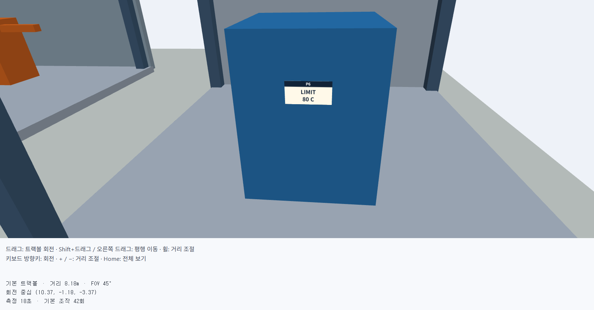
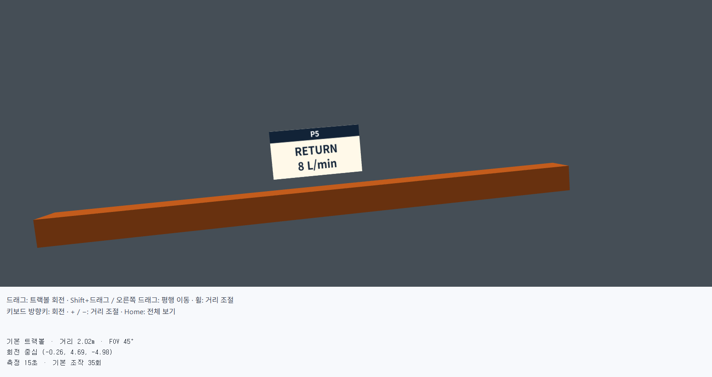
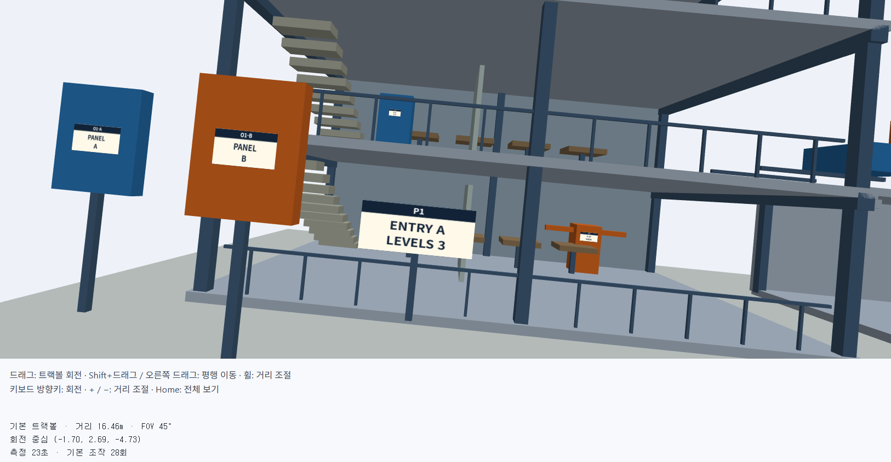
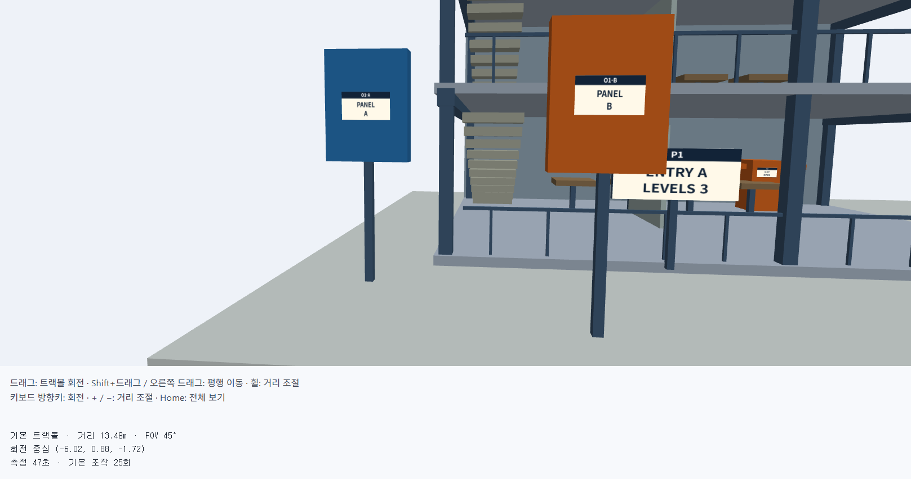
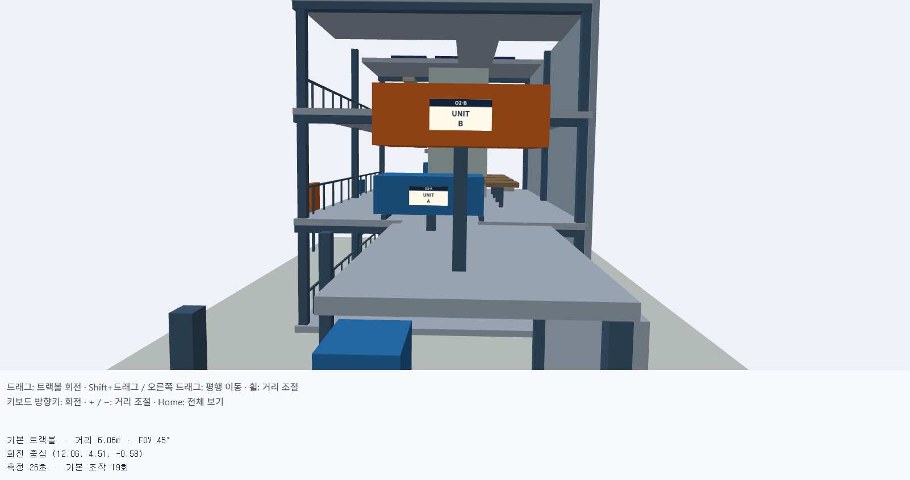
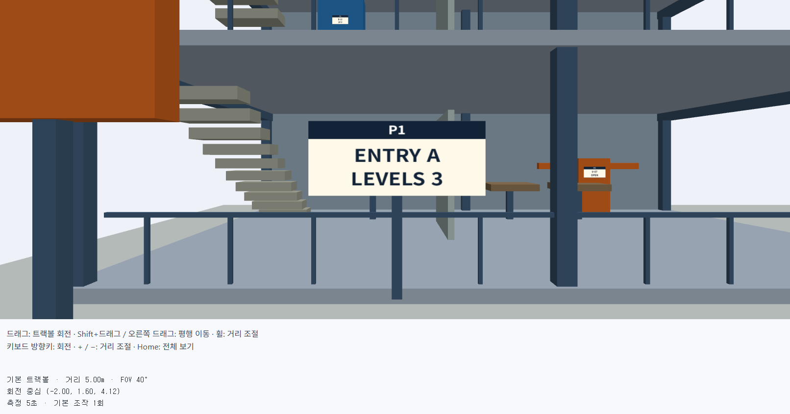
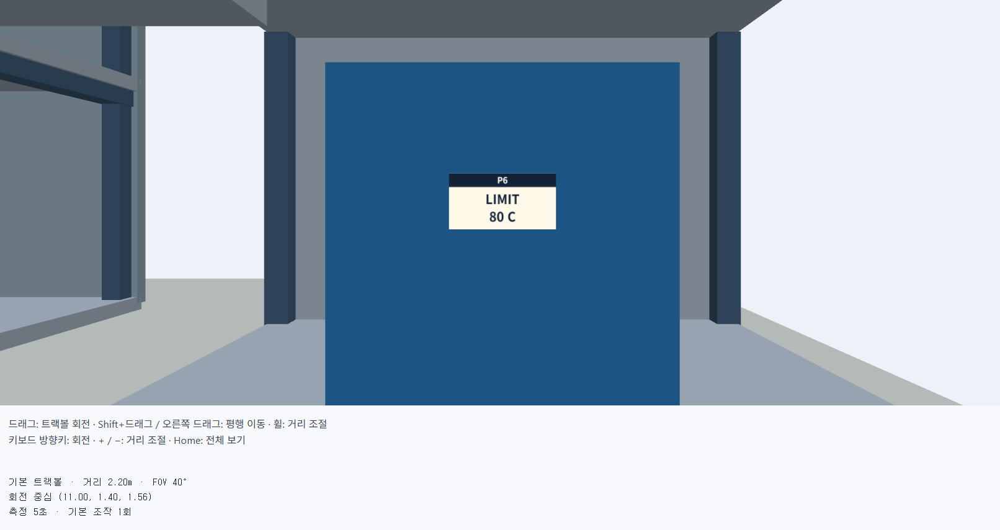
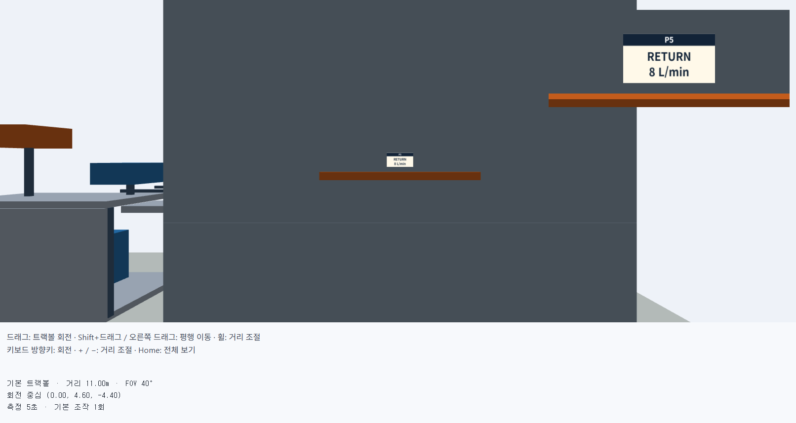
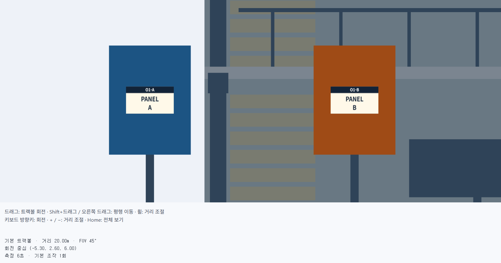
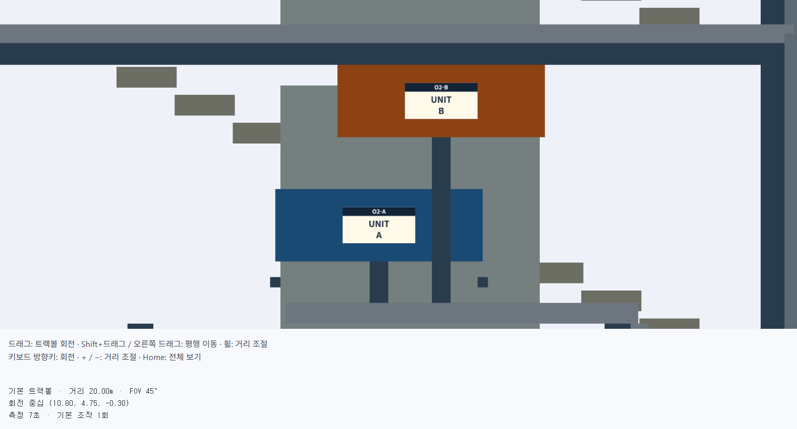

# 4주차 - 3D 조작을 몰라도 필요한 정보를 쉽게 찾아보기

- 이름: 장예령
- 저장소: https://github.com/yeryoung-jang/cg-2026-solar
- 실행: [Baseline](https://yeryoung-jang.github.io/cg-2026-solar/week4/baseline/) · [Improved](https://yeryoung-jang.github.io/cg-2026-solar/week4/improved/)

<br>

## 기본 버전 관찰

기본 트랙볼 인터페이스에서 P1-P6의 명판을 직접 찾아 정보를 확인하고 O1과 O2의 물체 비교를 시도했습니다.

각 항목은 초기화 버튼으로 측정을 초기화하고 시작했습니다. 마우스 왼쪽 드래그로 회전, 오른쪽 드래그로 평행 이동, 휠로 거리를 조절했습니다.

<br>

### 관찰 결과

| 항목 | 결과 | 확인한 내용 | 시간 | 기본 조작 횟수 |
| --- | :---: | :---: | --- | :---: |
| P1 본관 입구 안내 | 성공 | ENTRY A / LEVEL 3 | 23초 | 28회 |
| P2 1층 안쪽 밸브 | 성공 | V-07 / open | 10초 | 14회 |
| P3 2층 제어함 | 성공 | B-12 / 24 V | 10초 | 17회 |
| P4 옥상 서비스 장치 | 성공 | FILTER / 30 DAYS | 7초 | 26회 |
| P5 본관 뒤쪽 배관 | 성공 | RETURN / 8 L/min | 15초 | 35회 |
| P6 별관 펌프 | 성공 | LIMIT 80 C | 18초 | 42회 |
| O1 전면 패널 정렬 | 판단 보류 | A와 B의 높이와 폭 비교가 어려움 | 47초 | 25회 |
| O2 측면 돌출 비교 | 판단 보류 | A와 B의 돌출 정도 비교가 어려움 | 26초 | 19회 |

P1-P6은 모두 필요한 정보를 확인할 수 있었습니다. 다만 작은 명판이나 건물 안쪽과 뒤쪽에 있는 대상을 찾기 위해 회전, 확대, 평행 이동을 여러 번 반복해야 했습니다.

O1-O2는 두 대상을 화면에 함께 보이게 할 수는 있었지만 원근 투영 상태에서 정확한 비교가 어려워 판단을 보류했습니다.

<br>

## 기본 조작에서 불편했던 점

### 1. 원하는 지점까지 이동하기 위해 조작을 여러 번 반복해야 함

건물 전체가 보이는 상태에서는 작은 명판의 글자를 읽을 수 없기 때문에 대상을 찾은 뒤 여러 번 확대하고 카메라 방향을 조절해야 했습니다. 특히 P5는 35회, P6은 42회의 기본 조작이 필요했습니다. 대상의 위치가 건물 뒤쪽이나 별관에 있는 경우 먼저 위치를 찾기 위한 회전이 필요하고 이후 글자를 읽기 위한 확대와 위치 조정도 추가로 해야 했습니다.



<br>

### 2. 명판을 확대하면 전체 건물에서의 위치를 파악하기 어려움

작은 글자를 읽기 위해 가까이 확대하면 주변 건물이나 다른 장치가 화면에서 거의 보이지 않았습니다. P5의 경우 명판의 글자를 읽을 수 있을 정도로 확대했을 때는 배관과 명판만 크게 보였기 때문에 현재 보고 있는 장소가 전체 건물에서 어느 부분인지 동시에 확인하기 어려웠습니다.



<br>

### 3. 물체를 정면으로 보기 위한 카메라 조절이 어려움

트랙볼 회전으로 원하는 대상을 정면에서 보려고 하면 카메라의 방향을 직접 미세하게 조절해야 했습니다. 회전하는 과정에서 화면이 기울어지거나 대상이 화면 중심에서 벗어나면 다시 평행 이동을 해야 했습니다. P1에서는 안내판 자체는 비교적 쉽게 찾을 수 있었지만 글자가 잘 보이는 정면 방향과 위치를 맞추기 위해 추가적인 회전과 이동이 필요했습니다.



<br>

### 4. 원근 화면에서는 두 물체의 크기와 깊이를 정확하게 비교하기 어려움

O1에서는 파란색 A 패널과 주황색 B 패널을 한 화면에 놓고 높이와 폭을 비교하려 했습니다. 하지만 두 패널이 카메라에서 떨어진 거리가 다르고 원근 투영이 적용되어 있어 화면에서 보이는 크기만으로 실제 크기를 판단하기 어려웠습니다.



O2에서도 A와 B 장치를 측면에 가깝게 보이도록 했지만 정확한 측면 방향을 맞추기 어려웠고 원근 효과까지 포함되어 어느 장치가 더 앞으로 돌출되어 있는지 확신하기 어려웠습니다.



<br>

## 기본 버전 관찰 정리

기본 트랙볼을 사용하면 자유롭게 건물을 회전하고 확대하여 모든 장소를 살펴볼 수 있었지만 특정 정보를 빠르게 확인하기에는 조작이 많았습니다. 

특히 작은 명판을 읽을 때는 대상의 위치를 찾는 과정과 글자를 읽기 위한 확대 과정이 따로 필요했고 확대 후에는 전체 구조에서 현재 위치를 알기 어려웠습니다. 

또한 O1과 O2처럼 물체의 실제 크기나 돌출 정도를 비교해야 하는 경우에는 자유로운 원근 화면만으로 정확하게 판단하기 어려웠습니다.

따라서 개선 버전에서는 **원하는 관찰 지점으로 빠르게 이동할 수 있는 기능**, **명판과 주변 위치를 함께 확인할 수 있는 시점**, **O1과 O2를 정확하게 비교할 수 있는 시점**을 우선적으로 고려하려고 합니다.

<br>

## 사용자와 관찰 목표

이번 인터페이스는 3D 모델 조작에 익숙하지 않은 사용자가 복합 연구 시설의 장치 정보를 확인하는 상황을 기준으로 설계했습니다. 사용자는 자유롭게 건물을 탐색하는 것보다 지정된 위치의 명판을 빠르게 찾아 정보를 읽거나 두 장치의 크기와 돌출 정도를 비교하는 것이 주요 목적입니다.

따라서 개선 인터페이스의 목표를 다음과 같이 정했습니다.

- P1-P6의 지정된 관찰 지점을 빠르게 찾고 글자를 읽을 수 있도록 한다.
- 확대했을 때도 현재 어느 위치를 보고 있는지 이해하기 쉽게 한다.
- O1과 O2는 원근 효과의 영향을 줄이고 실제 형태를 비교할 수 있도록 한다.
- 관찰 후 전체 보기로 쉽게 돌아갈 수 있도록 한다.

<br>

## 개선안 설계

기본 버전을 사용하면서 원하는 관찰 위치까지 이동하기 위해 많은 조작이 필요하고 확대하면 전체 구조에서 현재 위치를 파악하기 어려운 문제가 있었습니다. 또한 O1과 O2는 원근 투영 때문에 물체의 크기와 깊이를 정확하게 비교하기 어려웠습니다.

이 문제를 해결하기 위해 두 가지 개선안을 생각했습니다.

### 개선안 1 - 관찰 지점 바로가기

P1-P6과 O1, O2 버튼을 만들고 버튼을 누르면 각 대상이 잘 보이는 카메라 위치로 바로 이동하도록 합니다. 

P1-P6은 명판을 읽기 좋은 시점을 사용하고 O1과 O2는 각각 전면과 측면에서 관찰할 수 있도록 합니다.

**장점**
- 원하는 위치를 빠르게 찾을 수 있다.
- 반복적인 회전과 확대 조작을 줄일 수 있다.
- 구현과 사용 방법이 비교적 단순하다.

**단점**
- 카메라 이동은 빨라지지만 내부 구조물에 가려지는 문제는 남아있다.
- 확대된 상태에서는 현재 위치를 파악하기 어려울 수 있다.
- 관찰 목적에 따른 기능 구분이 부족하다.

### 개선안 2 - 검사 모드와 포커스 렌즈

화면을 자유 탐색, 명판 검사, 비교의 세 가지 관찰 목적으로 구분합니다.

명판 검사 모드에서는 P1-P6 중 하나를 선택하면 카메라가 해당 위치로 이동하고 현재 관찰 중인 위치를 화면에 표시하여 확대된 상태에서도 어떤 대상을 보고 있는지 알 수 있도록 합니다.

비교 모드에서는 O1과 O2를 각각 정해진 방향의 직교 투영으로 보여 주어 원근 효과 없이 물체의 크기와 돌출 정도를 비교할 수 있도록 합니다.

**장점**
- 원하는 관찰 지점까지 빠르게 이동할 수 있다.
- 구조물에 가려지는 문제를 줄일 수 있다.
- 현재 관찰 중인 대상과 위치를 알기 쉽다.
- 관찰 목적에 따라 적절한 카메라와 투영 방식을 사용할 수 있다.

**단점**
- 단순한 바로가기 방식보다 구현해야 할 기능이 많다.
- 관찰 지점별로 카메라 위치와 가림 처리 대상을 직접 설정해야 한다.

### 선택한 개선안

두 방법을 비교한 결과 개선안 2인 **검사 모드와 포커스 렌즈 방식**을 선택했습니다.

단순히 이동 시간을 줄이는 것뿐 아니라 기본 버전에서 확인한 구조물 가림, 위치 파악, 원근 투영 문제를 함께 해결할 수 있기 때문입니다.

기존 트랙볼 조작도 자유 탐색 모드로 유지하여 필요하면 사용자가 직접 건물을 탐색할 수 있도록 할 계획입니다.

<br>

## 구현한 관찰 인터페이스

선택한 개선안에 따라 P1-P6의 명판 검사 버튼, P5 포커스 렌즈, O1-O2 직교 비교 모드, 전체 보기 기능을 구현했습니다.

기존 트랙볼 조작은 그대로 유지하며 버튼으로 이동한 후에도 사용자가 필요하면 직접 회전하거나 확대축소를 할 수 있도록 했습니다.

### 1. P1-P6 명판 검사

P1-P6 버튼을 누르면 해당 명판의 위치와 방향 데이터를 이용하여 카메라가 자동으로 이동하도록 구현했습니다.

명판의 `position`을 카메라가 바라보는 `target`으로 사용하고 `yaw`를 이용하여 명판의 앞면을 정면에서 볼 수 있도록 회전을 설정했습니다.

```javascript
viewer.controls.state.target = [...poi.position];

const halfYaw = poi.yaw / 2;

viewer.controls.state.rotation = [
  0,
  Math.sin(halfYaw),
  0,
  Math.cos(halfYaw)
];

viewer.controls.state.fov = 40;
```

각 명판의 크기와 주변 구조가 서로 다르기 때문에 모든 지점에 같은 거리를 적용하지 않고 실제 화면을 확인하면서 지점별 관찰 거리를 따로 조정했습니다.

```javascript
const focusDistance = {
  P1: 5.0,
  P2: 3.0,
  P3: 1.8,
  P4: 3.2,
  P5: 11.0,
  P6: 2.2
};

viewer.controls.state.distance = focusDistance[id] ?? 3.0;
```

P1처럼 큰 안내판은 주변 구조도 함께 보이도록 비교적 멀리 두었고 작은 명판인 P3과 P6은 글자를 읽을 수 있도록 더 가까운 거리를 사용했습니다.

또한 선택한 명판의 위치를 target으로 사용하기 때문에 버튼으로 이동한 뒤 자유롭게 회전할 때도 해당 지점이 회전 중심이 됩니다. 전체 보기에서는 기존의 건물 중심 시점으로 돌아갑니다.





<br>

### 2. P5 포커스 렌즈

P5는 본관 뒤쪽 벽에 붙어 있고 명판의 크기도 작아서 한 화면에서 주변 위치와 글자를 동시에 확인하기 어려웠습니다. 

따라서 P5에서는 메인 화면과 별도로 오른쪽 위에 명판을 확대해서 보여주는 포커스 렌즈를 추가했습니다. 

메인 화면은 기존 트랙볼 카메라를 그대로 사용하기 때문에 포커스 렌즈가 나타난 상태에서도 회전과 확대축소가 가능합니다.

```javascript
function renderWithFocusLens(v) {
  v.drawView(v.controls.camera());

  if (!focusLensPoi) return;

  const w = v.canvas.width;
  const h = v.canvas.height;

  const lensWidth = Math.round(w * 0.30);
  const lensHeight = Math.round(h * 0.30);

  const margin = Math.round(
    20 * Math.min(window.devicePixelRatio || 1, 2)
  );

  const viewport = [
    w - lensWidth - margin,
    h - lensHeight - margin,
    lensWidth,
    lensHeight
  ];

  v.drawView(
    makeLensCamera(focusLensPoi),
    viewport
  );
}
```
포커스 렌즈의 카메라는 명판의 `yaw` 방향을 이용하여 명판 앞쪽에 배치했습니다.

```javascript
const eye = [
  poi.position[0] + Math.sin(poi.yaw) * 1.2,
  poi.position[1],
  poi.position[2] + Math.cos(poi.yaw) * 1.2
];
```

따라서 메인 화면에서는 P5의 위치와 주변 구조를 확인하고 오른쪽 위 포커스 렌즈에서는 `RETURN / 8 L/min`을 크게 읽을 수 있도록 했습니다.



<br>

### 3. O1 전면 직교 비교

O1은 두 패널의 깊이 위치가 다르기 때문에 원근 투영 상태에서는 실제 크기를 정확하게 비교하기 어려웠습니다.

따라서 모델에 제공된 `viewDirection`을 이용하여 건물 앞쪽의 +z 위치에서 -z 방향을 바라보는 전면 직교 카메라를 만들었습니다.

```javascript
const eye = [
  comparison.position[0] - dir[0] * distance,
  comparison.position[1] - dir[1] * distance,
  comparison.position[2] - dir[2] * distance
];

const comparisonCamera = {
  eye,
  target: [...comparison.position],
  up: [0, 1, 0],
  orthographic: true,
  halfHeight: id === 'O1' ? 1.5 : 1.6
};
```

직교 투영에서는 물체까지의 거리에 따라 화면상의 크기가 달라지지 않기 때문에 A와 B를 같은 배율에서 비교할 수 있습니다.

O1을 확인한 결과 A와 B 패널의 폭은 같고 상단 높이도 같습니다.



<br>

### 4. O2 오른쪽 측면 직교 비교

O2는 별관 위 A와 B 장치의 앞쪽 돌출 정도를 비교하는 과제이므로 +x 위치에서 -x 방향을 바라보는 오른쪽 측면 직교 뷰를 사용했습니다.

직교 화면에서는 두 장치의 깊이 차이를 원근 효과 없이 비교할 수 있습니다.

O2를 확인한 결과 A가 B보다 건물 앞쪽으로 더 돌출되어 있습니다.

모델에서 A의 중심 z 좌표는 `0`, B는 `-0.6`이고 두 장치의 깊이는 모두 `2`이므로 +z 방향의 끝 위치는 각각 `1.0`,`0.4`입니다. 따라서 A가 B보다 약 `0.6m` 더 앞으로 돌출되어 있습니다.



<br>

### 5. 비교 모드의 화면 정리

O1과 O2에서는 비교와 관계없는 P1-P6 명판과 일부 가구, 일반 장비를 잠시 숨겨 비교 대상이 더 잘 보이도록 했습니다.

```javascript
viewer.model.poi.forEach((poi) => {
  viewer.hidden.add(poi.id);
});

viewer.hidden.add('furniture');
viewer.hidden.add('equipment');
```

비교 모드에서 일부 요소가 숨겨진 상태라는 것은 관찰 상태 영역에 표시하고 `전체 보기`를 누르면 다시 모두 복원되도록 했습니다.
```javascript
viewer.hidden.clear();
focusLensPoi = null;
viewer.render = null;
viewer.controls.home();
```

또한 P5의 포커스 렌즈가 켜진 상태에서 전체 보기를 눌렀을 때 확대창만 남는 문제가 있어, 기존 전체 보기 버튼에서도 `viewer.render`와 포커스 렌즈 상태를 함께 초기화하도록 수정했습니다.

<br>

### 6. 카메라 설정 정리

P1-P6에서는 선택한 명판의 `position`을 `target`으로 사용하고, 명판의 `yaw` 방향과 관찰 거리를 이용하여 카메라 위치가 결정되도록 했습니다. 카메라 위쪽 기준은 +y 방향을 사용합니다.

따라서 버튼으로 명판을 선택하면 해당 명판이 화면 중심이면서 회전 중심이 되고, 이후 트랙볼을 조작해도 선택한 지점을 중심으로 주변을 살펴볼 수 있습니다.

P1-P6은 공간감을 유지하기 위해 원근 투영과 FOV 40을 사용했습니다. 명판마다 크기와 주변 구조가 다르기 때문에 FOV를 계속 바꾸는 대신 관찰 거리를 각각 조정했습니다.

O1과 O2에서는 거리 때문에 크기가 달라 보이지 않도록 직교 투영을 사용하고 `up`은 `[0, 1, 0]`으로 고정했습니다. O1은 +z 에서 -z 방향, O2는 +x에서 -x 방향을 바라보도록 설정했습니다.

전체 보기를 선택하면 회전 중심과 카메라를 초기 상태로 복원합니다.

<br>

## 기존 버전과 개선 버전 비교

같은 환경에서 각 항목을 전체 보기 상태에서 시작하여 측정했습니다. 기본 버전에서는 트랙볼을 직접 조작하여 대상을 찾았고, 개선 버전에서는 추가한 관찰 버튼을 사용했습니다. 개선 버전의 버튼 클릭도 한 번의 사용자 조작으로 계산했습니다.

### 지점별 결과

| 항목 | 기본 버전 결과 | 기본 시간 | 기본 조작 | 개선 버전 결과 | 개선 시간 | 개선 조작 |
| :---: | :---: | :---: | :---: | :---: | :---: | :---: |
| P1 | 성공 | 23초 | 28회 | 성공 | 5초 | 1회 |
| P2 | 성공 | 10초 | 14회 | 성공 | 5초 | 1회 |
| P3 | 성공 | 10초 | 17회 | 성공 | 4초 | 1회 |
| P4 | 성공 | 7초 | 26회 | 성공 | 4초 | 1회 |
| P5 | 성공 | 15초 | 35회 | 성공 | 5초 | 1회 |
| P6 | 성공 | 18초 | 42회 | 성공 | 5초 | 1회 |
| O1 | 판단 보류 | 47초 | 25회 | 성공 | 6초 | 1회 |
| O2 | 판단 보류 | 26초 | 19회 | 성공 | 7초 | 1회 |

### 전체 결과 

| 비교 항목 | 기본 버전 | 개선 버전 |
| :---: | :---: | :---: |
| 관찰 완료 | 6 / 8 | 8 / 8 |
| 전체 시간 | 156초 | 41초 |
| 전체 조작 횟수 | 206회 | 8회 |

기본 버전에서는 P1-P6의 정보를 모두 확인할 수 있었지만 직접 회전하고 확대하는 과정이 많이 필요했습니다.

특히 P5와 P6은 각각 35회, 42회의 조작이 필요했고 O1과 O2는 두 대상을 찾더라도 정확한 정면, 측면 방향을 맞추기 어렵고 원근 효과도 있기 때문에 비교 결과를 확신하기 어려웠습니다.

개선 버전에서는 각 목적에 맞는 시점을 버튼으로 바로 선택할 수 있어 반복적인 탐색과 카메라 조작이 크게 줄었습니다.

또한 O1과 O2를 각각 정해진 방향의 직교 투영으로 보여주면서 기본 버전에서는 판단하지 못했던 두 비교 과제도 완료할 수 있었습니다.

<br>

처음에는 P1-P6의 명판 크기를 기준으로 관찰 거리를 자동으로 계산했습니다. 하지만 작은 명판에서는 카메라가 지나치게 가까워 글자는 잘 보이지만 주변 구조가 거의 보이지 않는 문제가 있었습니다.

따라서 하나의 계산식을 모든 지점에 사용하는 대신 실제 실행 화면을 확인하면서 각 지점에 적절한 관찰 거리를 따로 설정했습니다.

특히 P5는 벽에 비해 명판이 매우 작아 단순히 카메라 거리를 조정하는 것만으로 주변 구조와 글자를 동시에 보기가 어려웠습니다. 이를 해결하기 위해 메인 화면은 기존 트랙볼을 그대로 유지하고 별도의 작은 뷰에서 명판만 확대하는 포커스 렌즈를 추가했습니다.

구현 중에는 P5 뒤쪽 벽을 숨기는 방법도 시험했습니다. 벽을 없애면 건물 구조가 더 많이 보이지만 계단, 기둥 등이 한꺼번에 나타나 오히려 화면이 복잡해졌기 때문에 최종 버전에서는 사용하지 않았습니다.

최종적으로는 메인 화면에서는 기존 트랙볼 카메라를 사용하고, 포커스 렌즈만 별도의 카메라로 렌더링하는 방식으로 수정했습니다.

P6도 처음에는 명판이 조금 작게 보여 관찰 거리를 조정했고 최종적으로 `2.2m`에서 명판과 주변 구조가 함께 보이도록 설정했습니다.

<br>

## 개선 버전에서 새로 생긴 불편

개선 버전은 지정된 P1-P6과 O1-O2를 빠르게 관찰하는 데 초점을 맞췄기 때문에 미리 등록되지 않은 다른 위치를 살펴볼 때는 여전히 기존 트랙볼을 사용해야 합니다.

또한 P5는 다른 지점과 달리 포커스 렌즈가 함께 표시되어 화면 구성이 조금 더 복잡합니다. 하지만 메인 화면의 위치 정보와 작은 명판의 가독성을 동시에 확인하기 위해 필요한 기능이라고 판단했습니다. 

O1과 O2 비교 화면에서는 비교에 집중하기 위해 일부 명판과 가구를 숨기기 때문에 자유 탐색 상태와 화면 모습이 달라집니다. 대신 현재 숨김 상태를 표시하고 전체 보기를 누르면 원래 화면으로 돌아갈 수 있도록 했습니다.

<br>

## AI 활용 사례

이번 구현에서는 AI를 이용하여 교수님이 제공하신 코드의 구조를 확인하고 `d04-inspection-student.js`를 중심으로 새로운 관찰 기능을 추가했습니다.

처음에는 기본 트랙볼의 불편을 개선할 수 있는 인터페이스 아이디어를 AI에게 요청했습니다.

AI는 먼저 '관찰 지점 바로가기 방식'과 '상세 화면 분할 방식'을 제안했습니다. 하지만 두 방법 모두 사용은 편해질 수 있지만 기존 인터페이스와 비교했을 때 아이디어가 단순하다고 판단하여 다른 방법을 추가로 요청했습니다. 그 결과 '포커스 렌즈 모드', '미니맵 + 시선 방향 방식', '검사 모드'를 추가로 제안받았습니다.

이 중 미니맵 방식은 현재 위치를 확인하기에는 좋지만 화면에 새로운 지도와 방향 정보를 추가해야 해서 이번 과제에서 필요한 명판 읽기와 O1-O2 비교를 수행하기에는 기능이 많다고 판단했습니다.

반면 포커스 렌즈는 작은 명판과 주변 위치를 동시에 확인하는 데 적합했고, 검사 모드는 관찰 목적에 따라 P1-P6과 O1-O2의 시점을 구분하기 좋았습니다.

따라서 최종적으로 '검사 모드'를 기본 구조로 사용하고 한 화면에서 위치와 글자를 동시에 확인하기 어려웠던 P5에는 '포커스 렌즈'를 결합하는 방식을 선택했습니다.

<br>

## 측정의 한계

기본 버전을 먼저 사용하면서 P1-P6과 O1-O2의 위치를 이미 알게 되었기 때문에 개선 버전을 측정할 때는 위치를 처음 보는 상황보다 유리한 상태였습니다.

또한 개선 버전은 지정된 관찰 지점을 버튼으로 직접 선택하도록 설계했기 때문에 탐색 과정 자체가 크게 줄어듭니다.

따라서 시간과 조작 횟수 감소를 단순히 카메라 자체의 성능 차이라고 보기보다는 관찰 목적에 맞는 인터페이스를 제공한 결과로 해석했습니다.

기본 조작 횟수의 경우 휠 입력은 입력 정도와 기기에 따라 이벤트 횟수가 달라질 수 있기 때문에 조작 횟수만으로 판단하지 않고, 실제로 반복적인 회전과 확대가 줄었는지와 관찰 과제를 완료할 수 있었는지를 함께 비교했습니다.

<br>

## 최종 정리

기본 트랙볼은 건물을 자유롭게 탐색하기에는 적합했지만 지정된 작은 명판을 빠르게 읽거나 두 장치의 형태를 정확하게 비교하는 작업에서는 반복적인 조작이 필요했습니다.

개선 버전에서는 P1-P6의 위치와 방향 데이터를 이용한 자동 관찰 시점, P5 포커스 렌즈, O1-O2의 직교 비교 화면을 추가했습니다.

그 결과 관찰 완료 수는 6개에서 8개, 전체 시간은 156초에서 41초, 기록된 조작 횟수는 206회에서 8회로 줄었습니다.

특히 O1과 O2는 원근 투영 화면에서 판단을 보류했던 항목이었지만 정해진 방향의 직교 투영을 사용하면서 실제 형태 관계를 확인할 수 있었습니다.

이번 실습을 통해 자유롭게 움직일 수 있는 카메라만 제공하는 것보다 사용자가 확인하려는 정보와 관찰 목적에 맞게 카메라의 위치, 방향, 투영 방식을 함께 설계하는 것이 중요하다는 점을 확인했습니다.
